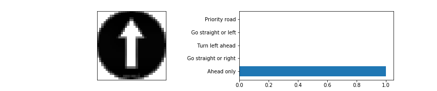
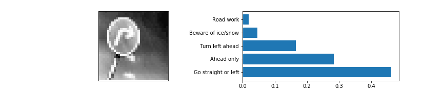
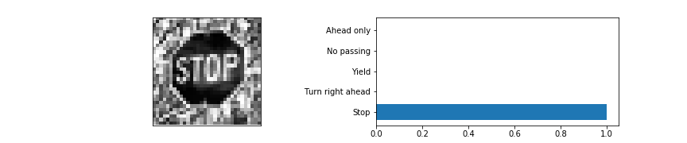
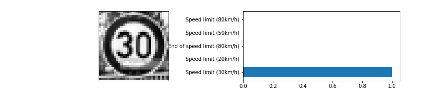
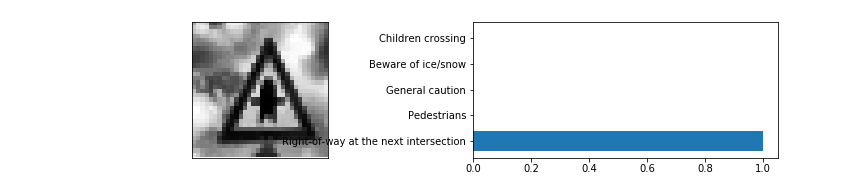
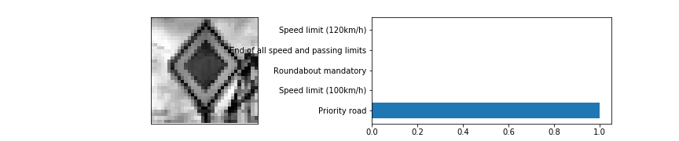
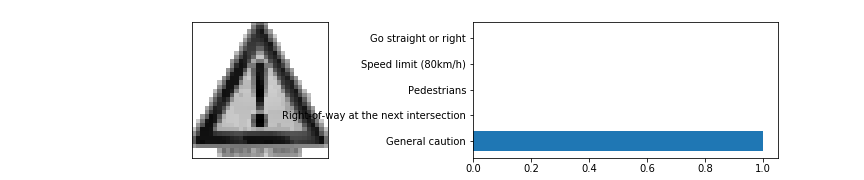
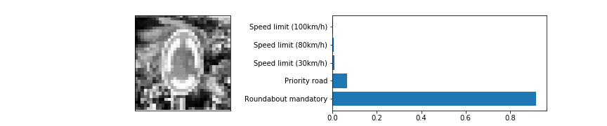
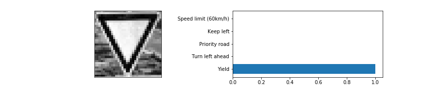
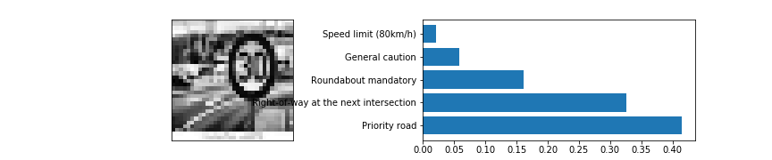

# **Traffic Sign Recognition** 

## Writeup

---

**Build a Traffic Sign Recognition Project**

The goals / steps of this project are the following:

* Load the data set (see below for links to the project data set)
* Explore, summarize and visualize the data set
* Design, train and test a model architecture
* Use the model to make predictions on new images
* Analyze the softmax probabilities of the new images
* Summarize the results with a written report

[//]: # (Image References)
 

[img_original_0]: ./out_images/img_original_0.png
[img_original_1]: ./out_images/img_original_1.png
[img_original_2]: ./out_images/img_original_2.png
[img_original_3]: ./out_images/img_original_3.png
[img_original_4]: ./out_images/img_original_4.png
[img_original_5]: ./out_images/img_original_5.png
[img_original_6]: ./out_images/img_original_6.png
[img_original_7]: ./out_images/img_original_7.png
[img_original_8]: ./out_images/img_original_8.png
[img_original_9]: ./out_images/img_original_9.png
[img_original_10]: ./out_images/img_original_10.png
[img_original_11]: ./out_images/img_original_11.png
[img_original_12]: ./out_images/img_original_12.png
[img_original_13]: ./out_images/img_original_13.png
[img_original_14]: ./out_images/img_original_14.png
[img_original_15]: ./out_images/img_original_15.png
[img_original_16]: ./out_images/img_original_16.png
[img_original_17]: ./out_images/img_original_17.png
[img_original_18]: ./out_images/img_original_18.png
[img_original_19]: ./out_images/img_original_19.png
[img_original_20]: ./out_images/img_original_20.png
[img_original_21]: ./out_images/img_original_21.png
[img_original_22]: ./out_images/img_original_22.png
[img_original_23]: ./out_images/img_original_23.png
[img_original_24]: ./out_images/img_original_24.png
[img_original_25]: ./out_images/img_original_25.png
[img_original_26]: ./out_images/img_original_26.png
[img_original_27]: ./out_images/img_original_27.png
[img_original_28]: ./out_images/img_original_28.png
[img_original_29]: ./out_images/img_original_29.png
[img_original_30]: ./out_images/img_original_30.png
[img_original_31]: ./out_images/img_original_31.png
[img_original_32]: ./out_images/img_original_32.png
[img_original_33]: ./out_images/img_original_33.png
[img_original_34]: ./out_images/img_original_34.png
[img_original_35]: ./out_images/img_original_35.png
[img_original_36]: ./out_images/img_original_36.png
[img_original_37]: ./out_images/img_original_37.png
[img_original_38]: ./out_images/img_original_38.png
[img_original_39]: ./out_images/img_original_39.png
[img_original_40]: ./out_images/img_original_40.png
[img_original_41]: ./out_images/img_original_41.png
[img_original_42]: ./out_images/img_original_42.png

[img_fake_0]: ./out_images/img_fake_0.png
[img_fake_1]: ./out_images/img_fake_1.png
[img_fake_2]: ./out_images/img_fake_2.png
[img_fake_3]: ./out_images/img_fake_3.png
[img_fake_4]: ./out_images/img_fake_4.png
[img_fake_5]: ./out_images/img_fake_5.png
[img_fake_6]: ./out_images/img_fake_6.png
[img_fake_7]: ./out_images/img_fake_7.png
[img_fake_8]: ./out_images/img_fake_8.png
[img_fake_9]: ./out_images/img_fake_9.png
[img_fake_10]: ./out_images/img_fake_10.png
[img_fake_11]: ./out_images/img_fake_11.png
[img_fake_12]: ./out_images/img_fake_12.png
[img_fake_13]: ./out_images/img_fake_13.png
[img_fake_14]: ./out_images/img_fake_14.png
[img_fake_15]: ./out_images/img_fake_15.png
[img_fake_16]: ./out_images/img_fake_16.png
[img_fake_17]: ./out_images/img_fake_17.png
[img_fake_18]: ./out_images/img_fake_18.png
[img_fake_19]: ./out_images/img_fake_19.png
[img_fake_20]: ./out_images/img_fake_20.png
[img_fake_21]: ./out_images/img_fake_21.png
[img_fake_22]: ./out_images/img_fake_22.png
[img_fake_23]: ./out_images/img_fake_23.png
[img_fake_24]: ./out_images/img_fake_24.png
[img_fake_25]: ./out_images/img_fake_25.png
[img_fake_26]: ./out_images/img_fake_26.png
[img_fake_27]: ./out_images/img_fake_27.png
[img_fake_28]: ./out_images/img_fake_28.png
[img_fake_29]: ./out_images/img_fake_29.png
[img_fake_30]: ./out_images/img_fake_30.png
[img_fake_31]: ./out_images/img_fake_31.png
[img_fake_32]: ./out_images/img_fake_32.png
[img_fake_33]: ./out_images/img_fake_33.png
[img_fake_34]: ./out_images/img_fake_34.png
[img_fake_35]: ./out_images/img_fake_35.png
[img_fake_36]: ./out_images/img_fake_36.png
[img_fake_37]: ./out_images/img_fake_37.png
[img_fake_38]: ./out_images/img_fake_38.png
[img_fake_39]: ./out_images/img_fake_39.png
[img_fake_40]: ./out_images/img_fake_40.png
[img_fake_41]: ./out_images/img_fake_41.png
[img_fake_42]: ./out_images/img_fake_42.png

[plot_distribution_initial]: ./out_images/plot_distribution_initial.png
[plot_distribution_after_fake]: ./out_images/plot_distribution_after_fake.png
[img_New-Images-For-Testing]: ./out_images/img_New-Images-For-Testing.png
[accuracy_loss]: ./out_images/accuracy_loss.png
[img_new-images-for-testing]: ./out_images/img_new-images-for-testing.png

[test_image_prediction_11]: ./out_images/test_image_prediction_11.png
[test_image_prediction_29]: ./out_images/test_image_prediction_29.png
[test_image_prediction_12]: ./out_images/test_image_prediction_12.png
[test_image_prediction_34]: ./out_images/test_image_prediction_34.png
[test_image_prediction_13]: ./out_images/test_image_prediction_13.png
[test_image_prediction_35]: ./out_images/test_image_prediction_35.png
[test_image_prediction_14]: ./out_images/test_image_prediction_14.png
[test_image_prediction_3]: ./out_images/test_image_prediction_3.png
[test_image_prediction_17]: ./out_images/test_image_prediction_17.png
[test_image_prediction_40]: ./out_images/test_image_prediction_40.png
[test_image_prediction_18]: ./out_images/test_image_prediction_18.png
[test_image_prediction_4]: ./out_images/test_image_prediction_4.png
[test_image_prediction_1]: ./out_images/test_image_prediction_1.png

[1_text_on_img]: ./test_images/1_text_on_img.jpg
[1_bg_rd]: ./test_images/1_bg_rd.jpg
[11_bg_cloudy_and_dull]: ./test_images/11_bg_cloudy_and_dull.jpg
[12_bg_building_and_cloudy]: ./test_images/12_bg_building_and_cloudy.jpg
[13_bg_dark]: ./test_images/13_bg_dark.jpg
[14_bg_tree]: ./test_images/14_bg_tree.jpg
[18_simple]: ./test_images/18_simple.jpg 
[34_tilted_and_blue_bg]: ./test_images/34_tilted_and_blue_bg.jpg
[35_nice]: ./test_images/35_nice.jpg
[40_bg_garden_bright]: ./test_images/40_bg_garden_bright.jpg
 

### Data Set Summary & Exploration

#### 1. Provide a basic summary of the data set. In the code, the analysis should be done using python, numpy and/or pandas methods rather than hardcoding results manually.

####summary statistics of the used traffic signs data set:
- Number of training examples = 34799
- Number of testing examples = 12630
- Number of validation examples = 4410
- Image data shape = (32, 32, 3)
- Number of classes = 43
 

#### 2. Include an exploratory visualization of the dataset.

#### Random samples of German traffic signs by sing-name: 

- 1:Speed limit (20km/h)

![][img_original_0]

- 2:Speed limit (30km/h)

![][img_original_1]

- 3:Speed limit (50km/h)

![][img_original_2]

- 4:Speed limit (60km/h)

![][img_original_3]

- 5:Speed limit (70km/h)

![][img_original_4]

- 6:Speed limit (80km/h)

![][img_original_5]

- 7:End of speed limit (80km/h)

![][img_original_6]

- 8:Speed limit (100km/h)

![][img_original_7]

- 9:Speed limit (120km/h)

![][img_original_8]

- 10:No passing

![][img_original_9]

- 11:No passing for vehicles over 3.5 metric tons

![][img_original_10]

- 12:Right-of-way at the next intersection

![][img_original_11]

- 13:Priority road

![][img_original_12]

- 14:Yield

![][img_original_13]

- 15:Stop

![][img_original_14]

- 16:No vehicles

![][img_original_15]

- 17:Vehicles over 3.5 metric tons prohibited

![][img_original_16]

- 18:No entry

![][img_original_17]

- 19:General caution

![][img_original_18]

- 20:Dangerous curve to the left

![][img_original_19]

- 21:Dangerous curve to the right

![][img_original_20]

- 22:Double curve

![][img_original_21]

- 23:Bumpy road

![][img_original_22]

- 24:Slippery road

![][img_original_23]

- 25:Road narrows on the right

![][img_original_24]

- 26:Road work

![][img_original_25]

- 27:Traffic signals

![][img_original_26]

- 28:Pedestrians

![][img_original_27]

- 29:Children crossing

![][img_original_28]

- 30:Bicycles crossing

![][img_original_29]

- 31:Beware of ice/snow

![][img_original_30]

- 32:Wild animals crossing

![][img_original_31]

- 33:End of all speed and passing limits

![][img_original_32]

- 34:Turn right ahead

![][img_original_33]

- 35:Turn left ahead

![][img_original_34]

- 36:Ahead only

![][img_original_35]

- 37:Go straight or right

![][img_original_36]

- 38:Go straight or left

![][img_original_37]

- 39:Keep right

![][img_original_38]

- 40:Keep left

![][img_original_39]

- 41:Roundabout mandatory

![][img_original_40]

- 42:End of no passing

![][img_original_41]

- 43:End of no passing by vehicles over 3.5 metric tons

![][img_original_42]

#### Histogram total avialable sample vs sing id: 

![][plot_distribution_initial]

 

### Design and Test a Model Architecture

#### 1. Describe how you preprocessed the image data. What techniques were chosen and why did you choose these techniques? Consider including images showing the output of each preprocessing technique. Pre-processing refers to techniques such as converting to grayscale, normalization, etc. (OPTIONAL: As described in the "Stand Out Suggestions" part of the rubric, if you generated additional data for training, describe why you decided to generate additional data, how you generated the data, and provide example images of the additional data. Then describe the characteristics of the augmented training set like number of images in the set, number of images for each class, etc.)

* Normalize images to reducing noise:
    * reducing noise helps in better training.
    * histogram equalization 
    [https://docs.opencv.org/3.1.0/d5/daf/tutorial_py_histogram_equalization.html]https://docs.opencv.org/3.1.0/d5/daf/tutorial_py_histogram_equalization.html
    * normalize images between range 0-1. 
    
* Create Fake images using existing samples:
    * by doing minor perspective transformations.
    * slightly modifying pixel brightness.
    * warping image by angular rotation.
    * cliping or rescaling images.
    * Try to keep changes small, as images in the dataset are small (32X32X3). 
    * I found big variations has negative effect on my test accuracy.
    
* Create fake images so that all class (sing-names) labels for has equal = 5000 samples each.
![][plot_distribution_after_fake]

* Summary : New fake images added=180201, now totaling=215000, was originally=34799 

##### Here are random samples from augmented/fake images:
- 1:Speed limit (20km/h)

![][img_fake_0]

- 2:Speed limit (30km/h)

![][img_fake_1]

- 3:Speed limit (50km/h)

![][img_fake_2]

- 4:Speed limit (60km/h)

![][img_fake_3]

- 5:Speed limit (70km/h)

![][img_fake_4]

- 6:Speed limit (80km/h)

![][img_fake_5]

- 7:End of speed limit (80km/h)

![][img_fake_6]

- 8:Speed limit (100km/h)

![][img_fake_7]

- 9:Speed limit (120km/h)

![][img_fake_8]

- 10:No passing

![][img_fake_9]

- 11:No passing for vehicles over 3.5 metric tons

![][img_fake_10]

- 12:Right-of-way at the next intersection

![][img_fake_11]

- 13:Priority road

![][img_fake_12]

- 14:Yield

![][img_fake_13]

- 15:Stop

![][img_fake_14]

- 16:No vehicles

![][img_fake_15]

- 17:Vehicles over 3.5 metric tons prohibited

![][img_fake_16]

- 18:No entry

![][img_fake_17]

- 19:General caution

![][img_fake_18]

- 20:Dangerous curve to the left

![][img_fake_19]

- 21:Dangerous curve to the right

![][img_fake_20]

- 22:Double curve

![][img_fake_21]

- 23:Bumpy road

![][img_fake_22]

- 24:Slippery road

![][img_fake_23]

- 25:Road narrows on the right

![][img_fake_24]

- 26:Road work

![][img_fake_25]

- 27:Traffic signals

![][img_fake_26]

- 28:Pedestrians

![][img_fake_27]

- 29:Children crossing

![][img_fake_28]

- 30:Bicycles crossing

![][img_fake_29]

- 31:Beware of ice/snow

![][img_fake_30]

- 32:Wild animals crossing

![][img_fake_31]

- 33:End of all speed and passing limits

![][img_fake_32]

- 34:Turn right ahead

![][img_fake_33]

- 35:Turn left ahead

![][img_fake_34]

- 36:Ahead only

![][img_fake_35]

- 37:Go straight or right

![][img_fake_36]

- 38:Go straight or left

![][img_fake_37]

- 39:Keep right

![][img_fake_38]

- 40:Keep left

![][img_fake_39]

- 41:Roundabout mandatory

![][img_fake_40]

- 42:End of no passing

![][img_fake_41]

- 43:End of no passing by vehicles over 3.5 metric tons

![][img_fake_42]
 

#### 2. Describe what your final model architecture looks like including model type, layers, layer sizes, connectivity, etc.) Consider including a diagram and/or table describing the final model.
* Model I settled with has following layers: Updated CNN based on Reviews. 
|-----------------------|-------------------------------------------------------------------------------------------| 
| Layer         		|  Description	(dimensions: input/output, kernel, stride, padding, activation function )  | 
|:---------------------:|:-----------------------------------------------------------------------------------------:| 
| Input         		| shape:32x32x1 	Gray normalized image 			                                        | 
|:---------------------:|:-----------------------------------------------------------------------------------------:| 
| CONV2D_LAYER_1    	| input:32x32x1,  output:28X28X16, kernel:5x5, stride=1X1, activation=relu, padding=VALID   |
| MAX_POOL_1	      	| input:28X28X16, output:14x14x16, kernel:2x2, stride=1X1, activation=relu, padding=VALID   |
|:---------------------:|:-----------------------------------------------------------------------------------------:| 
| CONV2D_LAYER_2    	| input:14x14x16, output:10x10x32, kernel:5x5, stride=1X1, activation=relu, padding=VALID   |
| MAX_POOL_2	      	| input:10x10x32, output:5x5x32,   kernel:2x2, stride=1X1, activation=relu, padding=VALID   |
|:---------------------:|:-----------------------------------------------------------------------------------------:| 
| CONV2D_LAYER_3    	| input:5x5x32,   output:3x3x128,  kernel:5x5, stride=1X1, activation=relu, padding=VALID   |
| MAX_POOL_3	      	| input:3x3x128,  output:2x2x128,  kernel:1x1, stride=1X1, activation=relu, padding=VALID   |
|:---------------------:|:-----------------------------------------------------------------------------------------:| 
| FULLY_CONNECTED_1    	| input:2x2x128=512, output:240,  activation=relu ,                                         |
| FULLY_CONNECTED_2    	| input:2x2x128=240, output:240,  activation=relu ,dropout                                  |
| FULLY_CONNECTED_3    	| input:2x2x128=240, output:43,   logit                                                     |
|:---------------------:|:-----------------------------------------------------------------------------------------:| 
| output    	        |  output:43 Output final layer (softmax, cross entropy)                                    |
|-----------------------|-------------------------------------------------------------------------------------------| 

 

* Final layer uses softmax to predict the most dominant of the 43 traffic sign classes.
* Idea of the previous exercices using LeNet and extended the count of filters, experimented on trafic sign dataset. 
 

#### 3. Describe how you trained your model. The discussion can include the type of optimizer, the batch size, number of epochs and any hyperparameters such as learning rate.

* trained model using GPU
* Used learning rate 0.001 and 75 epoch. 
* softmax on last layer.
* 43 classes are hot-encoded
* Goal is to minimize cross entropy between == 'softmax probabilty vector' vs 'hot-encoded labels vectors'
* AdamOptimizer to efficiently reduce cross entropy using gradient. 
* The adam (Adaptive Moment Estimation) optimizer, updates wights using an adaptive momentum. 

[wiki: Softmax_function](https://en.wikipedia.org/wiki/Softmax_function)

[wiki: Cross_entropy](https://en.wikipedia.org/wiki/Cross_entropy)

[wiki: Stochastic_gradient_descent](https://en.wikipedia.org/wiki/Stochastic_gradient_descent)

#### Final hyperparamters I used :

* EPOCHS = 75
* BATCH_SIZE = 128
* rate = 0.001 #learning rate, which is reduced after
* mu = 0 # mean for the weight initializations
* sigma = 0.1 #sigma for the weight initializations

* 10 epochs
* A batch size of 128 images
* A sigma of 0.1 for the weight initializations
* A learning rate of 0.001

* tried variations on cnn model as wel as hyperparamters to find best results. 
* after 60 epoch, there was not much improvement in model accuracy + loss.
 
#### 4. Describe the approach taken for finding a solution and getting the validation set accuracy to be at least 0.93. Include in the discussion the results on the training, validation and test sets and where in the code these were calculated. Your approach may have been an iterative process, in which case, outline the steps you took to get to the final solution and why you chose those steps. Perhaps your solution involved an already well known implementation or architecture. In this case, discuss why you think the architecture is suitable for the current problem.

####My final model results were:

train-acc = 1.000, train-loss = 0.001

valid-acc = 0.978, valid-loss = 0.114

Test Accuracy = 95.9%
  
* If an iterative approach was chosen:
    
* What was the first architecture that was tried and why was it chosen?
    
    Used many variations of the existing model. at one time the model started behaving worst, 
    I have to go back to many iteration to settle on the best performing model on given dataset.
    
* What were some problems with the initial architecture?

    I think the image are very small (32X32), compared to the iamges downloaded from google
    , and they are are very sensitive to augmentation. I have to play many variations of augmentation to get best results.
    Also I have to keep the model simple, as it was not helping by adding more layers or by reducing kernel size etc.

* How was the architecture adjusted and why was it adjusted? Typical adjustments could include choosing a different model architecture, adding or taking away layers (pooling, dropout, convolution, etc),
 using an activation function or changing the activation function. One common justification for adjusting an architecture would be due to overfitting or underfitting. 
 A high accuracy on the training set but low accuracy on the validation set indicates over fitting; a low accuracy on both sets indicates under fitting.

    As I observed the model was mostly over-fitting, and it was not able to correctly classify the images from google. and needed lot of finetuning - specifically in pre-processing and image augmentation and CNN layers, hyperparamters. 
    Any come times the model test accuracy fall far below 93%

* Which parameters were tuned? How were they adjusted and why?

    Initially the network was under-fitting, so I  dramatically increased  complexity by adding more layers -i.e. conv2d, maxpool,dropout, higher output depths etc. 
    Have to slowly reduce the complexity of network. 
    
    I wrote a class to calculate input and output layer shapes, so it was easy for me to change weigths on next layer. 
    This class is really added value to my exprience and learning CNN models, and could literally test 15 diffeernt combinations of = layers, kernel, stride combinations, dropwout, maxpool layers. 
 

* What are some of the important design choices and why were they chosen? For example, why might a convolution layer work well with this problem? How might a dropout layer help with creating a successful model?

    CNN network are well known for low number of  parameters wights compared to MLP. And invariance to rotations, translations, color, brightness etc is easy to achieve with CNN. 
    They are good for images and some parts of NLP. Simple CNN network like LeNet is better suitable given dataset.
 
![][accuracy_loss]

### Test a Model on New Images

#### 1. Choose five German traffic signs found on the web and provide them in the report. For each image, discuss what quality or qualities might be difficult to classify.

German traffic from google:

![][img_new-images-for-testing]

 

#### 2. Discuss the model's predictions on these new traffic signs and compare the results to predicting on the test set. At a minimum, discuss what the predictions were, the accuracy on these new predictions, and compare the accuracy to the accuracy on the test set (OPTIONAL: Discuss the results in more detail as described in the "Stand Out Suggestions" part of the rubric).

[1_text_on_img]: ./test_images/1_text_on_img.jpg
[1_bg_rd]: ./test_images/1_bg_rd.jpg
[11_bg_cloudy_and_dull]: ./test_images/11_bg_cloudy_and_dull.jpg
[12_bg_building_and_cloudy]: ./test_images/12_bg_building_and_cloudy.jpg
[13_bg_dark]: ./test_images/13_bg_dark.jpg
[14_bg_tree]: ./test_images/14_bg_tree.jpg
[18_simple]: ./test_images/18_simple.jpg 
[34_tilted_and_blue_bg]: ./test_images/34_tilted_and_blue_bg.jpg
[35_nice]: ./test_images/35_nice.jpg
[40_bg_garden_bright]: ./test_images/40_bg_garden_bright.jpg
 
* Here are the results of the prediction:

    * Prediction for: 35_nice.jpg
     * prediction:CORRECT
     * prediction: 35 = ground_truth: 35
     * (prediction: Ahead only = ground_truth:  Ahead only)
     * Desc: image is simple and has not the background 
     
     * ![][35_nice]
    
    * Prediction for: 34_tilted_and_blue_bg.jpg
     * prediction:WRONG
     * prediction: 37 = ground_truth: 34
     * (prediction: Go straight or left = ground_truth:  Turn left ahead)
     * Desc: image has lot of the background, is tilted. background color is close to sign color. area covderd by sing is smaller. 
      
     * ![][34_tilted_and_blue_bg]
   
    * Prediction for: 14_bg_tree.jpg
     * prediction:CORRECT
     * prediction: 14 = ground_truth: 14
     * (prediction: Stop = ground_truth:  Stop)
     * Desc: image has lot of tree structure in the background, but sign covers lot of area in image.
     
     * ![][14_bg_tree]
    
    * Prediction for: 1_text_on_img.jpg
     * prediction:CORRECT
     * prediction: 1 = ground_truth: 1
     * (prediction: Speed limit (30km/h) = ground_truth:  Speed limit (30km/h))
     * Desc: image has lot of tree structure in the background, but sign covers lot of area in image. Text on the image
     
     * ![][1_text_on_img]
    
    * Prediction for: 11_bg_cloudy_and_dull.jpg
     * prediction:CORRECT
     * prediction: 11 = ground_truth: 11
     * (prediction: Right-of-way at the next intersection = ground_truth:  Right-of-way at the next intersection)
     * Desc: image has cloudy the background. Sign has lot of color shade similar to backgound.
 
     * ![][11_bg_cloudy_and_dull]
    
    * Prediction for: 1_bg_rd.jpg
     * prediction:WRONG
     * prediction: 12 = ground_truth: 1
     * (prediction: Priority road = ground_truth:  Speed limit (30km/h))
     * Desc: image has road in the background, sign cover less total area in image. Also there is text in image.
      
     * ![][1_bg_rd]
   
    * Prediction for: 12_bg_building_and_cloudy.jpg
     * prediction:CORRECT
     * prediction: 12 = ground_truth: 12
     * (prediction: Priority road = ground_truth:  Priority road)
     * Desc: image has building in the background on one side. Sign has lot of color shade similar to backgound.
     
     * ![][12_bg_building_and_cloudy]
    
    * Prediction for: 18_simple.jpg
     * prediction:CORRECT
     * prediction: 18 = ground_truth: 18
     * (prediction: General caution = ground_truth:  General caution)
     * Desc: its much larger version of image than dataset. It has nothing in the backgound. Some texty below the image.
     
     * ![][18_simple]
    
    * Prediction for: 40_bg_garden_bright.jpg
     * prediction:CORRECT
     * prediction: 40 = ground_truth: 40
     * (prediction: Roundabout mandatory = ground_truth:  Roundabout mandatory)
     * Desc: image has very noisy garden in the background. Sign covers almost 20-25% of the image.
   
     * ![][40_bg_garden_bright]
    
    * Prediction for: 13_bg_dark.jpg
     * prediction:CORRECT
     * prediction: 13 = ground_truth: 13
     * (prediction: Yield = ground_truth:  Yield)
     * Desc: image has dask asphalt in the background.
     
     * ![][13_bg_dark]

 

Analysis:
* The model is not good when the sign has noisy background, specifically when total  area covered by sign is small 
* 2 out of  10 imagesare predicted WRONG. 
 
#### 3. Describe how certain the model is when predicting on each of the five new images by looking at the softmax probabilities for each prediction. Provide the top 5 softmax probabilities for each image along with the sign type of each probability. (OPTIONAL: as described in the "Stand Out Suggestions" part of the rubric, visualizations can also be provided such as bar charts)

* Polting the predictions 

    * Probabilites for:  35_nice
        * Predicted:  [9.9999940e-01 3.9732635e-07 1.9154007e-07 1.9426991e-09 4.7052591e-11]
        * Predicted labels:  ['Speed limit (20km/h)', 'Speed limit (20km/h)', 'Speed limit (20km/h)', 'Speed limit (20km/h)', 'Speed limit (20km/h)']
        * Actual:  35  'Ahead only'
        *  
        
    * Probabilites for:  34_tilted_and_blue_bg
        * Predicted:  [0.46268767 0.2832978  0.16593878 0.04593997 0.01863735]
        * Predicted labels:  ['Speed limit (20km/h)', 'Speed limit (20km/h)', 'Speed limit (20km/h)', 'Speed limit (20km/h)', 'Speed limit (20km/h)']
        * Actual:  34  'Turn left ahead'
        * 
    
    * Probabilites for:  14_bg_tree
        * Predicted:  [1.0000000e+00 3.8599207e-08 1.2985755e-09 7.3310372e-11 5.8552344e-11]
        * Predicted labels:  ['Speed limit (30km/h)', 'Speed limit (20km/h)', 'Speed limit (20km/h)', 'Speed limit (20km/h)', 'Speed limit (20km/h)']
        * Actual:  14  'Stop'
        * 
    
    * Probabilites for:  1_text_on_img
        * Predicted:  [1.0000000e+00 3.0251870e-09 8.2512285e-13 5.0150867e-13 4.9070665e-13]
        * Predicted labels:  ['Speed limit (30km/h)', 'Speed limit (20km/h)', 'Speed limit (20km/h)', 'Speed limit (20km/h)', 'Speed limit (20km/h)']
        * Actual:  1  'Speed limit (30km/h)'
        * 
    
    * Probabilites for:  11_bg_cloudy_and_dull
        * Predicted:  [1.0000000e+00 1.4025155e-09 1.9993918e-14 2.8029436e-15 2.0752062e-15]
        * Predicted labels:  ['Speed limit (30km/h)', 'Speed limit (20km/h)', 'Speed limit (20km/h)', 'Speed limit (20km/h)', 'Speed limit (20km/h)']
        * Actual:  11  'Right-of-way at the next intersection'
        * 
    
    * Probabilites for:  12_bg_building_and_cloudy
        * Predicted:  [1.0000000e+00 2.6060300e-16 2.2209826e-17 5.0915630e-18 2.3992194e-18]
        * Predicted labels:  ['Speed limit (30km/h)', 'Speed limit (20km/h)', 'Speed limit (20km/h)', 'Speed limit (20km/h)', 'Speed limit (20km/h)']
        * Actual:  12  'Priority road'
        * 
    
    * Probabilites for:  18_simple
        * Predicted:  [1.0000000e+00 1.2358383e-16 2.8143883e-21 3.2215066e-23 8.8084185e-24]
        * Predicted labels:  ['Speed limit (30km/h)', 'Speed limit (20km/h)', 'Speed limit (20km/h)', 'Speed limit (20km/h)', 'Speed limit (20km/h)']
        * Actual:  18  'General caution'
        * 
    
    * Probabilites for:  40_bg_garden_bright
        * Predicted:  [0.91770154 0.0645071  0.00980236 0.00564105 0.00208697]
        * Predicted labels:  ['Speed limit (20km/h)', 'Speed limit (20km/h)', 'Speed limit (20km/h)', 'Speed limit (20km/h)', 'Speed limit (20km/h)']
        * Actual:  40  'Roundabout mandatory'
        * 
    
    * Probabilites for:  13_bg_dark
        * Predicted:  [1.0000000e+00 1.5613817e-24 2.4409469e-25 3.2101175e-26 1.3687834e-31]
        * Predicted labels:  ['Speed limit (30km/h)', 'Speed limit (20km/h)', 'Speed limit (20km/h)', 'Speed limit (20km/h)', 'Speed limit (20km/h)']
        * Actual:  13  'Yield'
        * 
    
    * Probabilites for:  1_bg_rd
        * Predicted:  [0.41491506 0.3261279  0.16122474 0.05820386 0.02110911]
        * Predicted labels:  ['Speed limit (20km/h)', 'Speed limit (20km/h)', 'Speed limit (20km/h)', 'Speed limit (20km/h)', 'Speed limit (20km/h)']
        * Actual:  1  'Speed limit (30km/h)'
        * 

 
 
    * ![][test_image_prediction_1]

### (Optional) Visualizing the Neural Network (See Step 4 of the Ipython notebook for more details)
 

